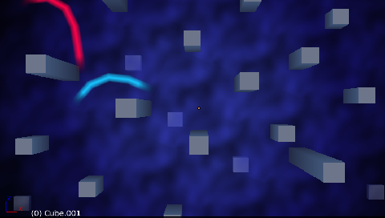
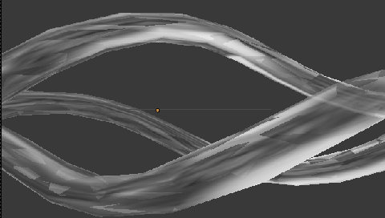
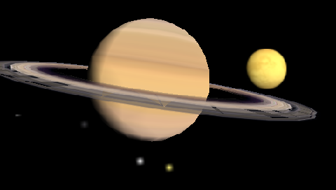
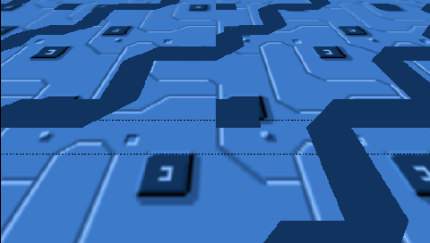

XMB GMO CONVERTER
-----------------

This can convert ply 1.0 models to GMO models to use as background on PSP XMB menu.

You need:
- tga file (image/texture)
- ply (3D model with texture, vertex colors, and normals, -z fordward / y up)
- txt (settings file)

All files (tga, ply and txt) must use the same name (test.tga test.ply text.txt), then drag and drop any of them to XMB_GMO executable, and the program will create the model.
Edit txt file to animate models, do not change the file structure, just edit the float numbers and leave the rest.

TXT file settings:
- F Texture filter: 0 off / 1 on, "0" does not work, filter is always on.
- T Texture mapping mode: 0 UV COORDS / 1 ENV MAP (reflection).
- S Animation speed, animation has 240 frames, so 60.000000 fps will make it last 4 seconds.
- TRANSLATE ANIMATION: 4 key frames (XYZ positions, for frame 0, 80, 160, 240).
- SCALE ANIMATION: 4 key frames (XYZ positions, for frame 0, 80, 160, 240).
- ROTATE ANIMATION: 4 key frames (XYZ rotations in radians, for frame 0, 80, 160, 240. 360º = 6.28319 rad).
- TEXTURE ANIMATION: 4 key frames (U pos + V pos + Width + Height, for frame 0, 80, 160, 240).

Test models as they look on Blender (look better on PSP):

.

.

.

